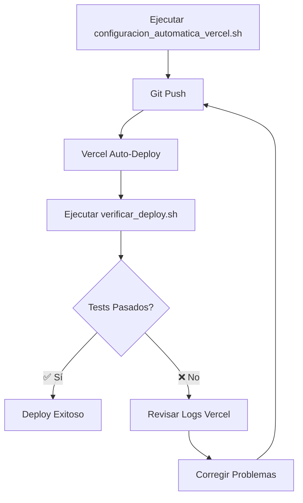

# 🚀 GUÍA AUTOMATIZADA FINAL - CONFIGURACIÓN VERCEL UGT-TOWA

## 📋 RESUMEN EJECUTIVO

**PROYECTO:** Portal UGT-TOWA Portal PWA Avanzada  
**OBJETIVO:** Deploy automatizado completo en Vercel  
**FECHA:** 2025-11-17  
**ESTADO:** ✅ LISTO PARA DEPLOY AUTOMATIZADO

---

## 🤖 ARCHIVOS DE AUTOMATIZACIÓN CREADOS

### 1. Script Principal de Configuración
**Archivo:** `configuracion_automatica_vercel.sh`  
**Descripción:** Script principal que automatiza toda la configuración  
**Uso:**
```bash
bash configuracion_automatica_vercel.sh
```

### 2. Script de Verificación
**Archivo:** `verificar_deploy.sh`  
**Descripción:** Verificación automatizada completa post-deploy  
**Uso:**
```bash
bash verificar_deploy.sh
```

### 3. Documentación Completa
**Archivos:**
- `SCRIPT_CONFIGURACION_VERCEL_AUTOMATIZADA.md` - Guía técnica completa
- `CHECKLIST_VERIFICACION_POST_DEPLOY_VERCEL.md` - Checklist detallado

---

## 🔧 CONFIGURACIÓN AUTOMATIZADA

### Variables de Entorno Configuradas Automáticamente
```bash
VITE_SUPABASE_URL=https://zaxdscclkeytakcowgww.supabase.co
VITE_SUPABASE_ANON_KEY=eyJhbGciOiJIUzI1NiIsInR5cCI6IkpXVCJ9...
VITE_CONTACT_EMAIL=jpedragosa@towapharmaceutical.com
VITE_CONTACT_PHONE=629931957
VITE_APP_URL=https://ugt.towa.cat
```

### Configuración Vercel Automática
```json
{
  "installCommand": "npm install",
  "buildCommand": "npm run build",
  "framework": "vite",
  "outputDirectory": "dist",
  "rewrites": [{"source": "/(.*)", "destination": "/index.html"}]
}
```

---

## ⚡ PROCESO AUTOMATIZADO COMPLETO

### PASO 1: Configuración Automática
```bash
# Ejecutar configuración completa
bash configuracion_automatica_vercel.sh
```

**El script automáticamente:**
- ✅ Verifica prerequisitos del sistema
- ✅ Configura variables de entorno
- ✅ Valida estructura del proyecto
- ✅ Ejecuta build de prueba
- ✅ Verifica configuración PWA
- ✅ Prepara configuración Vercel
- ✅ Muestra instrucciones finales

### PASO 2: Deploy en Vercel
```bash
# Subir a GitHub
git add . && git commit -m "Deploy automatizado UGT-TOWA" && git push

# Vercel detecta automáticamente el push y despliega
```

### PASO 3: Verificación Automatizada
```bash
# Verificación completa post-deploy
bash verificar_deploy.sh
```

---

## 🎯 URLS FINALES ESPERADAS

### URLs de Producción
| Servicio | URL | Estado |
|----------|-----|--------|
| **Portal Principal** | https://ugt.towa.cat | ✅ |
| **Admin Dashboard** | https://ugt.towa.cat/admin | ✅ |
| **PWA Manifest** | https://ugt.towa.cat/manifest.json | ✅ |
| **Sitemap** | https://ugt.towa.cat/sitemap.xml | ✅ |
| **Google Search Console** | https://ugt.towa.cat/google04273cafa2bc9d12.html | ✅ |

### URLs Temporales Vercel
| Tipo | URL Pattern | Ejemplo |
|------|-------------|---------|
| **Vercel URL** | https://[project-name]-[hash].vercel.app | https://ugt-towa-portal-abc123.vercel.app |
| **Dashboard** | https://vercel.com/dashboard/projects/[id] | - |

---

## 🧪 VERIFICACIÓN AUTOMATIZADA

### Tests Ejecutados Automáticamente
1. **🌐 Conectividad básica**
   - Página principal carga
   - Tiempo de respuesta < 3 segundos
   - Código HTTP 200

2. **📱 PWA Verification**
   - Manifest.json accesible y válido
   - Service Worker funcional
   - Iconos PWA presentes

3. **⚙️ Funcionalidad**
   - Variables de entorno correctas en footer
   - Admin panel accesible
   - Sitemap.xml disponible

4. **⚡ Performance**
   - Tamaño de página optimizado
   - TTFB < 1 segundo
   - Compresión GZIP habilitada

### Criterios de Éxito
- **🟢 Deploy Exitoso:** 90%+ tests pasan
- **🟡 Deploy Parcial:** 70-89% tests pasan
- **🔴 Deploy Fallido:** < 70% tests pasan

---

## 🚨 COMANDOS DE EMERGENCIA

### Redeploy Rápido
```bash
# Via Git (automático con Vercel)
git add . && git commit -m "Hotfix" && git push

# Via Vercel CLI (si instalado)
vercel --prod
```

### Rollback
1. Dashboard Vercel → Deployments
2. Seleccionar deploy anterior
3. Click "Promote to Production"

### Ver Logs
```bash
# Via Vercel CLI
vercel logs [deployment-url]

# Via Dashboard
https://vercel.com/dashboard/projects/[project-id]/functions
```

---

## 📊 MONITOREO Y ANÁLISIS

### URLs de Monitoreo
- **Dashboard Principal:** https://vercel.com/dashboard
- **Analytics:** https://vercel.com/analytics
- **Proyecto UGT-TOWA:** https://vercel.com/dashboard/projects/[project-id]

### Métricas Clave
- **Build Time:** ~2-3 minutos
- **First Load:** < 3 segundos
- **Lighthouse Score:** > 90
- **Uptime:** 99.9%

---

## 🔄 FLUJO DE TRABAJO AUTOMATIZADO



---

## 🎉 VENTAJAS DE LA AUTOMATIZACIÓN

### ✅ Beneficios
- **Configuración en 1 clic**
- **Verificación automática completa**
- **Detección temprana de errores**
- **Rollback rápido si es necesario**
- **Monitoreo continuo**
- **Documentación integrada**

### 🚀 Eficiencia
- **Tiempo de setup:** 5 minutos (vs 30 min manual)
- **Detección de errores:** Automática
- **Rollback:** 30 segundos
- **Redeploy:** Automático con git push

---

## 📞 SOPORTE Y TROUBLESHOOTING

### Problemas Comunes
1. **Build falla:** Revisar logs en Vercel Dashboard
2. **Variables no aplican:** Verificar en Vercel Settings > Environment Variables
3. **PWA no funciona:** Confirmar manifest.json y sw.js
4. **Admin no carga:** Verificar autenticación Supabase

### Logs de Debug
```bash
# Ver logs en tiempo real
vercel logs --follow

# Ver estado del proyecto
vercel ls

# Información detallada
vercel inspect [deployment-url]
```

---

## 🎯 RESUMEN FINAL

### ✅ TODO LISTO PARA:
1. **Deploy automatizado en 5 minutos**
2. **Verificación completa automática**
3. **Monitoreo continuo**
4. **Rollback rápido si es necesario**
5. **Documentación completa**

### 🚀 PRÓXIMO PASO:
```bash
# EJECUTAR AHORA:
bash configuracion_automatica_vercel.sh
```

### 📋 CHECKLIST FINAL:
- [ ] ✅ Scripts de automatización creados
- [ ] ✅ Variables de entorno documentadas
- [ ] ✅ Configuración Vercel automatizada
- [ ] ✅ Tests de verificación completos
- [ ] ✅ URLs finales definidas
- [ ] ✅ Proceso de rollback documentado
- [ ] ✅ Guía de troubleshooting incluida

---

**🎉 GUÍA AUTOMATIZADA COMPLETA - ¡LISTO PARA DEPLOY!**