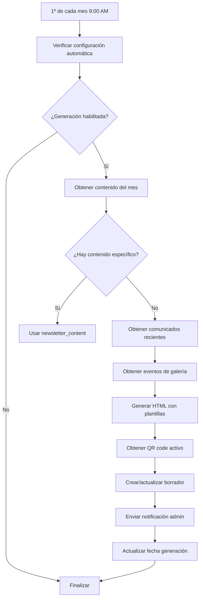
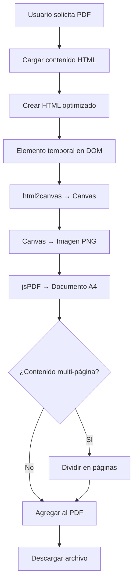
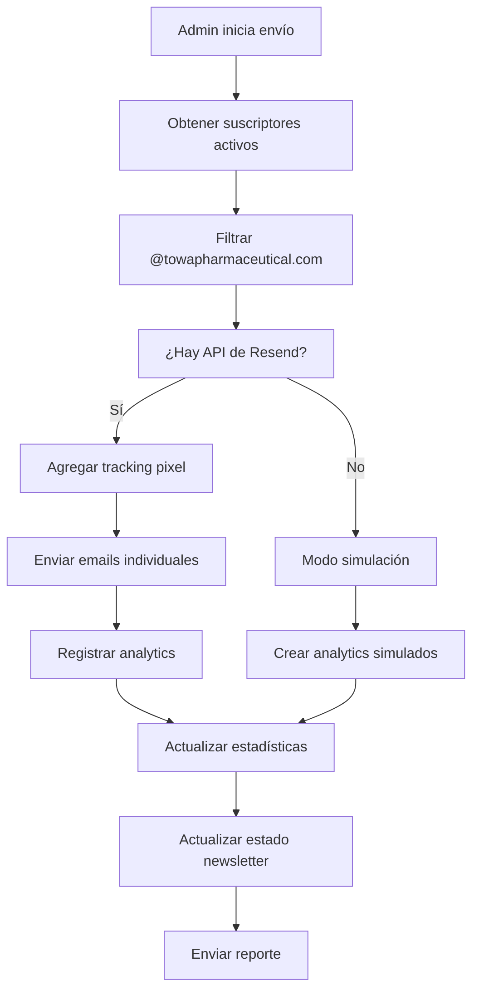

# Resumen Técnico - Sistema Newsletter UGT Towa

## 📋 Estructura de Base de Datos

### Tablas Principales

```sql
-- Suscriptores del newsletter
newsletter_subscribers {
  id: UUID (PK)
  email: VARCHAR(255) UNIQUE
  name: VARCHAR(255)
  subscribed_at: TIMESTAMPTZ
  is_active: BOOLEAN
  created_at: TIMESTAMPTZ
}

-- Contenido específico del newsletter
newsletter_content {
  id: UUID (PK)
  type: ENUM('news', 'events', 'statistics', 'directives', 'suggestions')
  title: VARCHAR(500)
  content: TEXT
  image_url: TEXT
  created_at: TIMESTAMPTZ
  is_published: BOOLEAN
  published_at: TIMESTAMPTZ
  created_by: UUID
}

-- Newsletters enviados/generados
newsletters_sent {
  id: UUID (PK)
  subject: VARCHAR(500)
  content: TEXT
  sent_at: TIMESTAMPTZ
  total_sent: INTEGER
  opened_count: INTEGER
  clicked_count: INTEGER
  status: ENUM('draft', 'approved', 'sent', 'failed')
  created_by: UUID
  approved_by: UUID
  approved_at: TIMESTAMPTZ
}

-- Códigos QR para afiliación
qr_codes {
  id: UUID (PK)
  title: VARCHAR(255)
  description: TEXT
  image_url: TEXT
  is_active: BOOLEAN
  created_at: TIMESTAMPTZ
  updated_at: TIMESTAMPTZ
  created_by: UUID
}
```

## 🔄 Flujos de Trabajo Principales

### 1. Generación Automática de Newsletter



### 2. Generación de PDF



### 3. Envío de Newsletter



## 🏗️ Arquitectura de Edge Functions

### Functions Principales

| Función | Propósito | Estado | Criticidad |
|---------|-----------|--------|------------|
| `generate-monthly-draft` | Generación básica | ⚠️ Obsoleta | Baja |
| `generate-monthly-draft-v2` | Generación con fallback | ✅ Funcional | Media |
| `generate-monthly-draft-v3` | Generación completa | ✅ Recomendada | Alta |
| `send-newsletter` | Distribución por email | ✅ Funcional | Alta |
| `generate-newsletter-pdf` | Generación de PDF | 🔴 Limitada | Alta |
| `track-email-event` | Analytics de email | ✅ Funcional | Media |
| `upload-newsletter-image` | Subida de imágenes | ✅ Funcional | Media |

### Configuración de CORS

```javascript
const corsHeaders = {
    'Access-Control-Allow-Origin': '*',
    'Access-Control-Allow-Headers': 'authorization, x-client-info, apikey, content-type',
    'Access-Control-Allow-Methods': 'POST, OPTIONS',
    'Access-Control-Max-Age': '86400',
};
```

## 🎨 Sistema de Plantillas HTML

### Estructura Base del Newsletter

```html
<!DOCTYPE html>
<html lang="es">
<head>
    <meta charset="UTF-8">
    <meta name="viewport" content="width=device-width, initial-scale=1.0">
    <title>Newsletter UGT Towa - [Mes Año]</title>
    <style>
        body {
            font-family: Arial, sans-serif;
            line-height: 1.6;
            color: #333;
            max-width: 600px;
            margin: 0 auto;
            padding: 20px;
            background-color: #f4f4f4;
        }
        .container {
            background-color: #ffffff;
            padding: 30px;
            border-radius: 8px;
            box-shadow: 0 2px 4px rgba(0,0,0,0.1);
        }
        .header {
            background-color: #e50000;
            color: white;
            padding: 20px;
            text-align: center;
            border-radius: 8px 8px 0 0;
            margin: -30px -30px 30px -30px;
        }
        .section {
            margin-bottom: 30px;
        }
        .section-title {
            color: #e50000;
            font-size: 20px;
            font-weight: bold;
            border-bottom: 2px solid #e50000;
            padding-bottom: 8px;
            margin-bottom: 15px;
        }
        .content-item {
            margin-bottom: 20px;
            padding: 15px;
            background-color: #f9f9f9;
            border-left: 4px solid #e50000;
            border-radius: 4px;
        }
    </style>
</head>
<body>
    <div class="container">
        <div class="header">
            <h1>Newsletter UGT Towa</h1>
            <p>[Mes Año]</p>
        </div>
        
        <!-- Contenido dinámico -->
        
    </div>
</body>
</html>
```

### Variables Dinámicas

```javascript
// Variables disponibles en plantillas
const templateVars = {
    monthName: "enero", // Nombre del mes
    year: "2025",        // Año actual
    qrCode: {...},       // Datos del QR code
    content: {...},      // Contenido por secciones
    contact: {           // Información de contacto
        email: "jpedragosa@towapharmaceutical.com",
        address: "Polígono Industrial, Carrer de Sant Martí, 75-97, 08107 Martorelles, Barcelona"
    }
};
```

## 📊 Sistema de Analytics

### Tracking Implementado

```javascript
// Eventos rastreados
const trackingEvents = {
    open: {
        method: "tracking_pixel",
        endpoint: "/functions/v1/track-email-event",
        params: "?event=open&newsletter_id={id}&email={email}"
    },
    click: {
        method: "link_tracking",
        endpoint: "/functions/v1/track-email-event", 
        params: "?event=click&newsletter_id={id}&email={email}"
    },
    unsubscribe: {
        method: "link_tracking",
        endpoint: "/functions/v1/track-email-event",
        params: "?event=unsubscribe&newsletter_id={id}&email={email}"
    }
};
```

### Métricas Almacenadas

```sql
-- Tabla email_analytics (referenciada pero no migrada)
email_analytics {
  id: UUID (PK)
  newsletter_id: UUID (FK)
  email: VARCHAR(255)
  bounced: BOOLEAN
  opened_at: TIMESTAMPTZ
  clicked_at: TIMESTAMPTZ
  created_at: TIMESTAMPTZ
}
```

## 🔧 Configuración del Sistema

### Variables de Entorno

```javascript
// Edge Functions requieren
const requiredEnvVars = {
    SUPABASE_URL: "https://[project].supabase.co",
    SUPABASE_SERVICE_ROLE_KEY: "[service-role-key]",
    RESEND_API_KEY: "[resend-api-key]" // Opcional
};
```

### Configuración de Autogeneración

```sql
-- Tabla newsletter_config (referenciada pero no migrada)
newsletter_config {
  id: UUID (PK)
  auto_generation_enabled: BOOLEAN DEFAULT true
  last_generation_date: TIMESTAMPTZ
  generation_time: TIME DEFAULT '09:00:00'
  created_at: TIMESTAMPTZ DEFAULT NOW()
  updated_at: TIMESTAMPTZ DEFAULT NOW()
}
```

## 🚀 Flujo de Desarrollo Recomendado

### 1. Entorno Local

```bash
# Instalación de dependencias
npm install @supabase/supabase-js jspdf html2canvas

# Configuración de variables
cp .env.example .env.local
# Editar .env.local con credenciales

# Desarrollo
npm run dev
```

### 2. Despliegue de Edge Functions

```bash
# Desplegar función específica
supabase functions deploy generate-monthly-draft-v3

# Verificar despliegue
supabase functions list

# Logs en tiempo real
supabase functions logs generate-monthly-draft-v3
```

### 3. Migraciones de Base de Datos

```sql
-- Crear migraciones faltantes
CREATE TABLE newsletter_editions (
    id UUID PRIMARY KEY DEFAULT gen_random_uuid(),
    title VARCHAR(500) NOT NULL,
    content JSONB NOT NULL,
    status VARCHAR(50) DEFAULT 'draft',
    subscribers_count INTEGER DEFAULT 0,
    created_at TIMESTAMPTZ DEFAULT NOW(),
    sent_at TIMESTAMPTZ,
    created_by UUID,
    auto_generated BOOLEAN DEFAULT false
);

CREATE TABLE newsletter_config (
    id UUID PRIMARY KEY DEFAULT gen_random_uuid(),
    auto_generation_enabled BOOLEAN DEFAULT true,
    last_generation_date TIMESTAMPTZ,
    created_at TIMESTAMPTZ DEFAULT NOW(),
    updated_at TIMESTAMPTZ DEFAULT NOW()
);
```

## ⚠️ Problemas Conocidos

### 1. **PDF Backend No Funcional**
```javascript
// Problema: Edge Functions no soportan jsPDF/Puppeteer
// Solución temporal: Procesamiento en frontend
// Solución recomendada: Migrar a service externo (PDFShift, HTMLCSStoImage)
```

### 2. **Tablas Sin Migraciones**
```javascript
// Problema: newsletter_editions y newsletter_config referenciadas pero no creadas
// Solución: Crear migraciones manuales
```

### 3. **Gestión de Imágenes Limitada**
```javascript
// Problema: Solo upload base64, sin optimización
// Solución: Implementar procesamiento de imágenes con Sharp
```

### 4. **Editor WYSIWYG Básico**
```javascript
// Problema: contentEditable con funcionalidades limitadas
// Solución: Integrar TinyMCE, Quill.js o similar
```

## 📈 Métricas de Performance

### Tiempos de Respuesta Actuales

| Operación | Tiempo Estimado | Estado |
|-----------|----------------|--------|
| Generación de borrador | 2-5 segundos | ✅ Bueno |
| Envío de newsletter | 1-3 segundos/email | ⚠️ Mejorable |
| Generación de PDF | 5-15 segundos | 🔴 Lento |
| Subida de imágenes | 3-8 segundos | ⚠️ Mejorable |

### Recomendaciones de Performance

```javascript
// 1. Cache de contenido generado
const cachedContent = await redis.get(`newsletter:${monthYear}`);

// 2. Batch processing para emails
const batchSize = 50;
const batches = chunk(subscribers, batchSize);

// 3. Compresión de imágenes
const optimizedImage = await sharp(image)
    .resize(800, 600)
    .jpeg({ quality: 85 })
    .toBuffer();
```

---

**Documento técnico generado**: 16 de Noviembre de 2025  
**Versión**: 1.0  
**Estado del sistema**: Funcional con mejoras pendientes